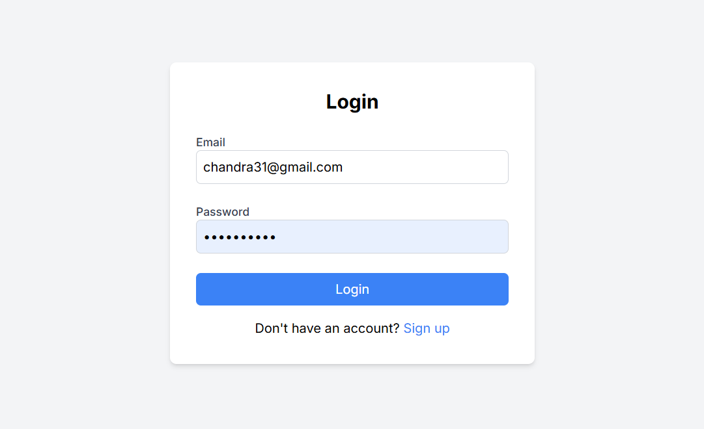
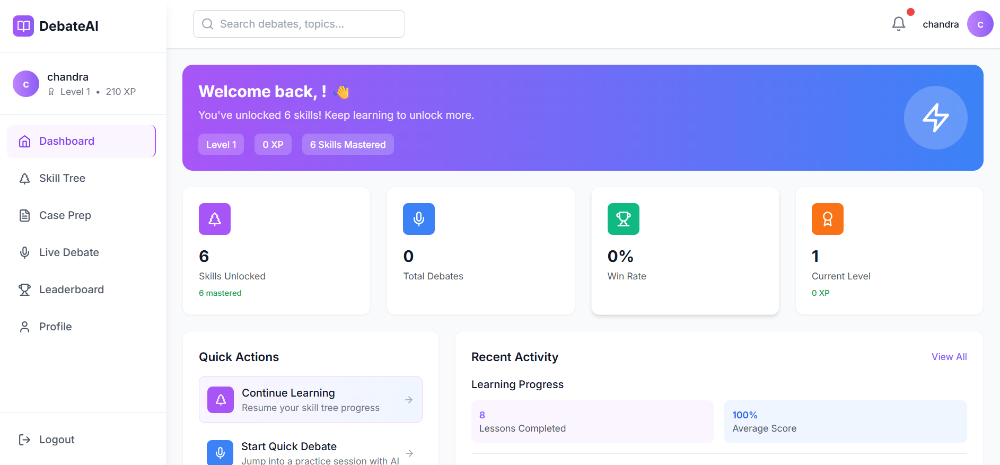

# DebateVerse AI: Your AI-Powered Debate Training Platform

A free, open-source, and production-ready platform designed to help students and professionals master the art of argumentation through AI-powered debate practice.

## Screenshots

## Screenshots

| Login/Signup Page  | Dashboard  | Skill Tree Page  |
|---|---|---|
|  |  |  |

| Lesson Page  | Exercise Page  | Case Prep Page  |
|---|---|---|
|  |  |  |

| Live Debate Page  | Live Debate Results  | Profile Page  |
|---|---|---|
|  |  |  |

| Leaderboard Page  | Admin Dashboard  |
|---|---|
|  |  |

##  Features

*   **AI Sparring Partner:** Practice your debate skills against intelligent AI opponents that adapt to your skill level. The AI is powered by Meta's LLaMA 3 model via the Groq API for fast, high-quality responses.
*   **Structured Learning Paths:** Progress through a Duolingo-style skill tree with guided lessons and interactive exercises covering various debate techniques, from basic argumentation to advanced rhetorical strategies.
*   **Real-time Feedback & Transcription:** Get instant analysis of your performance during live debates. The platform uses the browser's built-in Speech Recognition to transcribe your arguments in real-time.
*   **Case Preparation Tool:** Utilize AI to help structure your arguments, generate contentions, find potential rebuttals, and gather supporting evidence for any given topic.
*   **Comprehensive Progress Tracking:** Monitor your experience points (XP), current level, debate history, and skill mastery on your personal dashboard.
*   **Responsive Design:** A mobile-first and touch-friendly interface ensures a seamless learning experience on any device.

##  Tech Stack

*   **Frontend:** React, TypeScript, Vite, Tailwind CSS, Framer Motion
*   **Backend & Database:** Firebase (Firestore, Authentication, Storage)
*   **AI Integration:** Groq API (using the `llama3-8b-8192` model)
*   **Testing:** Vitest
*   **Deployment:** Configured for Netlify, Vercel, or any static hosting service.

##  Getting Started

These instructions will get you a copy of the project up and running on your local machine for development and testing purposes.

### Prerequisites

*   Node.js (LTS version recommended)
*   npm (comes with Node.js)
*   A Firebase project (the free "Spark" plan is sufficient)
*   A Groq API Key

### Installation & Setup

1.  **Clone the repository:**
    ```bash
    git clone https://github.com/Chandra731/DebateAI
    cd Debate-AI
    ```

2.  **Install dependencies:**
    ```bash
    npm install
    ```

3.  **Set up Firebase:**
    *   Go to the [Firebase Console](https://console.firebase.google.com/) and create a new project.
    *   In your new project, go to **Build > Authentication** and enable the **Email/Password** sign-in method.
    *   Go to **Build > Firestore Database** and create a new database. Start in **test mode** for now (we'll add security rules later).
    *   In your Project Settings (click the ⚙️ icon), scroll down to the "Your apps" section.
    *   Register a new **Web app**.
    *   Copy your Firebase project configuration object. It will look like this:
        ```javascript
        const firebaseConfig = {
          apiKey: "AIza...",
          authDomain: "your-project-id.firebaseapp.com",
          projectId: "your-project-id",
          storageBucket: "your-project-id.appspot.com",
          messagingSenderId: "...",
          appId: "1:..."
        };
        ```

4.  **Configure Environment Variables:**
    *   Create a `.env` file in the project root by copying the example:
        ```bash
        cp .env.example .env
        ```
    *   Update `.env` with your Firebase credentials and your Groq API key. The variable names must match the ones in `.env.example`.
        ```env
        VITE_FIREBASE_API_KEY=your_firebase_api_key
        VITE_FIREBASE_AUTH_DOMAIN=your_firebase_auth_domain
        VITE_FIREBASE_PROJECT_ID=your_firebase_project_id
        VITE_FIREBASE_STORAGE_BUCKET=your_firebase_storage_bucket
        VITE_FIREBASE_MESSAGING_SENDER_ID=your_firebase_messaging_sender_id
        VITE_FIREBASE_APP_ID=your_firebase_app_id
        
        VITE_GROQ_API_KEY=your_groq_api_key_here
        ```

5.  **Set up Firestore Security Rules:**
    *   For development, you can use rules that allow access to authenticated users. In the Firebase Console, navigate to **Firestore Database > Rules** and paste the following:
    *   **IMPORTANT:** These rules are for development only. You must configure more secure rules for a production environment.
        ```firestore
        rules_version = '2';
        service cloud.firestore {
          match /databases/{database}/documents {
            // Allow users to read/write their own profile
            match /profiles/{userId} {
              allow read, write: if request.auth != null && request.auth.uid == userId;
            }
            // Allow authenticated users to read public data and write their own data
            match /{collection}/{docId} {
               allow read: if request.auth != null;
               allow write: if request.auth != null && request.resource.data.user_id == request.auth.uid;
            }
          }
        }
        ```

6.  **Seed the database (Optional but Recommended):**
    *   This script populates your Firestore with initial debate topics, skill trees, and other necessary data to make the app functional.
    *   ```bash
        npm run seed
        ```

7.  **Start the development server:**
    ```bash
    npm run dev
    ```
    The application should now be running at `http://localhost:5173`.

##  Admin Access

To access the admin dashboard, you must manually grant admin privileges to a user in Firestore.

1.  **Create a user account** through the application's signup page.
2.  **Open your project** in the [Firebase Console](https://console.firebase.google.com/).
3.  Navigate to **Build > Firestore Database**.
4.  In the `profiles` collection, find the document corresponding to the user you just created (the document ID is the user's UID from the Authentication tab).
5.  **Add a new field** to this user's document:
    *   **Field Name:** `isAdmin`
    *   **Type:** `boolean`
    *   **Value:** `true`
6.  Save the changes. That user will now have access to the "Admin" link in the application sidebar.

##  Project Structure

```
/src
├── App.tsx                # Main application component with routing logic
├── main.tsx               # Application entry point
├── components/            # Reusable React components, organized by feature
│   ├── Auth/              # Protected routes and auth-related UI
│   ├── common/            # Buttons, spinners, and other general components
│   ├── Layout/            # Header, Sidebar, and main app layout
│   └── SkillTree/         # Components for the interactive skill tree
├── contexts/              # React context providers for global state
│   ├── AuthContext.tsx    # Manages user authentication state and profile data
│   └── ...
├── hooks/                 # Custom React hooks for abstracting component logic
│   ├── useDatabase.ts     # Hooks for interacting with Firestore collections
│   └── useSkillTree.ts    # Logic for managing skill tree state and progress
├── pages/                 # Top-level page components for each route
│   ├── LiveDebatePage.tsx # The core real-time debate interface
│   └── SkillTreePage.tsx  # Page for displaying the learning path
├── services/              # Services for interacting with external APIs
│   ├── database.ts        # Abstracts all interactions with the Firestore database
│   └── groqService.ts     # Handles all API calls to the Groq AI service
├── types.ts               # Global TypeScript type definitions
└── utils/                 # Utility functions (security, config, etc.)
```

##  Testing

The project uses Vitest for unit and component testing.

*   **Run all tests in the console:**
    ```bash
    npm run test
    ```
*   **Run tests with an interactive UI:**
    ```bash
    npm run test:ui
    ```
*   **Generate a test coverage report:**
    ```bash
    npm run test:coverage
    ```

##  Deployment

The application is built as a static site and is optimized for easy deployment.

### Netlify (Recommended)

1.  Push your code to a GitHub repository.
2.  Connect the repository to a new site in Netlify.
3.  Configure the build settings:
    *   **Build command:** `npm run build`
    *   **Publish directory:** `dist`
4.  Add your environment variables from your `.env` file to the Netlify site configuration under **Site settings > Build & deploy > Environment**.
5.  Deploy the site. Netlify will automatically build and deploy your project on every push to the main branch.

##  Security

The application includes several client-side security measures located in `src/utils/security.ts`:

*   **Input Sanitization:** Functions to clean user inputs to mitigate XSS risks.
*   **Client-Side Rate Limiting:** A simple mechanism to prevent spamming of certain functions.
*   **Secure Storage Wrapper:** Utilities for safely storing data in the browser's local storage.
*   **Password Strength Validation:** UI feedback to guide users toward creating strong passwords.
